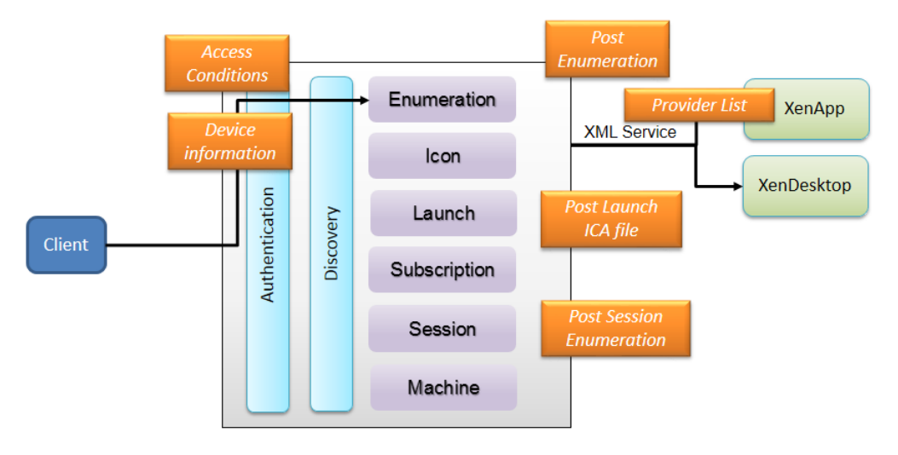

#About StoreFront Store Customization SDK

These topics introduce the Citrix StoreFront Store Customization SDK (the "StoreCustomization SDK"), describe what interfaces are available and how to use them. Additional resources that are available, such as scripts and examples, are also detailed. These topics are aimed at experienced administrators and software developers who have programming skills and are familiar with using SDKs.

The Store Customization SDK allows you to perform more advanced filtering and customization than the simple filtering by resource type or keywords available in Citrix StoreFront. If you only want to configure simple filtering on stores, such as preventing some users from seeing specific applications, there's no need to use the SDK; see the StoreFront documentation for more information about configuring filtering using PowerShell cmdlets.

The Store Customization SDK allows you to apply custom logic to the process of displaying resources to users and to adjust launch parameters. For example, you can use the SDK to control which apps and desktops are displayed to users, to change ICA virtual channel parameters, or to modify access conditions through XenApp and XenDesktop policy selection.

The following illustration shows the main points where you can apply customizations using the SDK.

These customization points are:

- Post-Enumeration—use this to modify the results of resource enumeration. This lets you alter a   resource's properties, and provides more advanced filtering than the simple filtering by resource type/keywords available using PowerShell cmdlets.

- Post-Launch ICA file—use this to modify the generated ICA file. For example, use this to change ICA virtual channel parameters and prevent users accessing their clipboard.

- Post-Session Enumeration—use this to modify the result of session enumeration; for example, to filter out unwanted sessions.

- Access conditions (pre-launch and pre-enumeration)—use this to modify the access conditions affecting resource visibility and ability to launch resources.

- Provider list—use this to modify the list of servers for Delivery Controllers before the XML services are contacted.

- Device information—use this to modify the device information supplied by the client, including the ClientName and DeviceId. 

###Additional resources
The following resources are also provided with this SDK:

- Store Service Customization API file—this is an MSDN-style library for the interfaces and classes used in the Customization contract.

- Visual Studio sample solution—a sample solution containing typical customization examples.

- Tracing script—a PowerShell script is supplied with the SDK which you can use to enable tracing. This is useful when testing and troubleshooting customizations.
