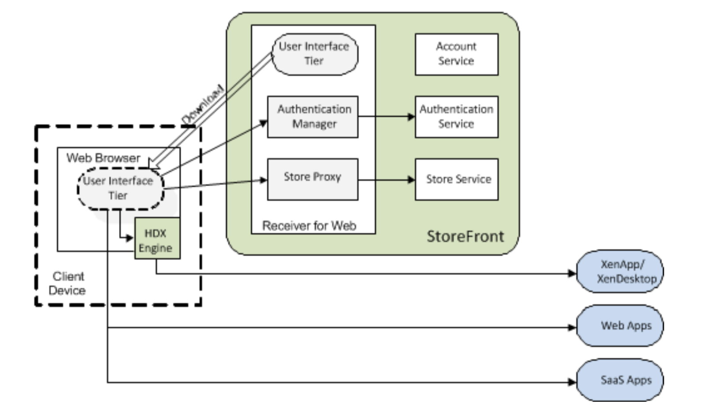

# Overview of the Citrix Receiver for Web
Citrix Receiver for Web is a component of Citrix StoreFront. Citrix Receiver for Web provides access to IT resources such as Windows apps, desktops, documents, Web apps and SaaS apps, all using the Web. Citrix Receiver for Web comprises a User Interface tier (referred to as the UI tier) and a Citrix StoreFront Services Web Proxy tier (referred to as the Web Proxy). The Citrix Receiver for Web architecture is illustrated below.

## UI tier
The UI tier is responsible for displaying the Citrix Receiver for Web user interface and responding to user interactions. The UI tier is implemented using JavaScript/Ajax technology, loaded to and executed at the Web browser. It is divided into three areas:

* Plugin Assistant—detects whether the native HDX engine is installed and provides UI for downloading Citrix Receiver.
* Authentication—deals with authentication matters; for example, log on, change password, and log off.
* Store—responsible for the main Citrix Receiver for Web functionality, such as store browsing, search, subscription, launch, workspace control, etc.

## Web Proxy tier

The Web Proxy is a bridge between the UI tier and Citrix StoreFront Services. The Web Proxy provides a simplified API to Citrix StoreFront Services suitable for consumption by a JavaScript/Ajax client running in a Web browser. The Web Proxy comprises of two parts: a Web Auth Manager and a Store Proxy, which are hosted in a single Web app.

* The **Web Auth Manager** provides support for the UI tier to authenticate users. It also manages the authentication tokens used by the Store Proxy when communicating with the Citrix StoreFront Store Service. The authentication tokens issued by the Authentication Service are kept at the Web Proxy and are not passed to the UI tier. Instead, the Web Auth Manager maps browser cookies (i.e. HTTP sessions) to authentication tokens, shielding the client from some of the complexity of the Citrix StoreFront authentication process.
* The **Store Proxy** provides an API for the UI tier to access resources supplied by the Citrix StoreFront Store Service. It also provides optimizations for Web access; for example, persistent icon caching, combining some Store Service operations and converting resource information from XML to JSON.


Many of the facilities available through the Store Service API are also available through the Web Proxy, which typically proxies requests through to the Store Service (supplying requisite authentication tokens) and transforming responses into JavaScript-friendly JSON representation, as appropriate. The main operations available through the Web Proxy include:


* Authenticating users through a variety of mechanisms: explicit forms, domain pass- through, smart card, gateway single sign-on, and post credentials.
* Enumeration of resources from a single Citrix StoreFront Store Service. This may itself aggregate resources from various servers, with load-balancing and failover support for XenApp and XenDesktop sites with multiple controllers.
* Launching apps or desktops remotely using the ICA protocol.
* Launching desktops remotely using the RDP protocol.
* Launching SaaS and Web apps published on App Controller, using single sign-on.
* Powering-off specific XenDesktop desktops.
* Retrieving images and icons for resources.
* Subscribing to resources, allowing different clients to store data associated with a subscribed resource.
* Enumerating available user sessions and session-related operations: reconnect, disconnect and logoff.
